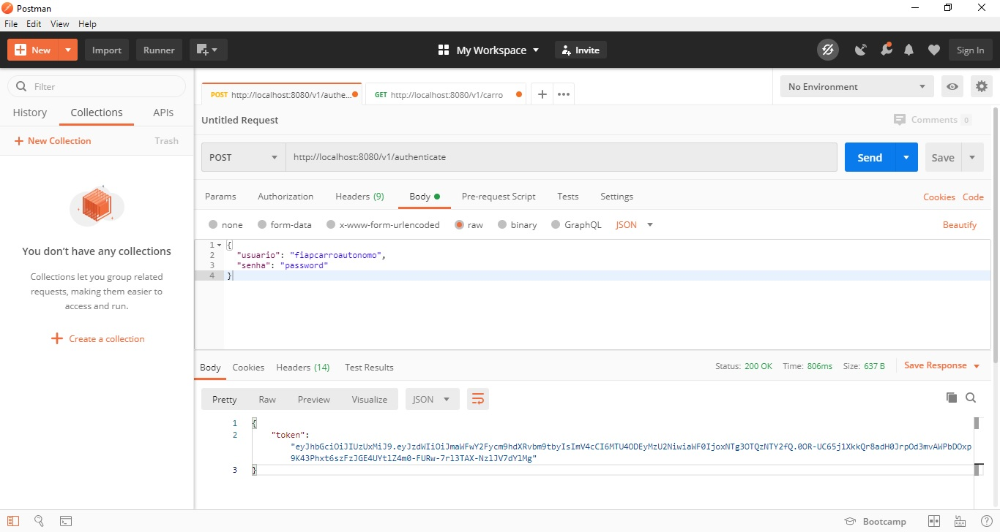
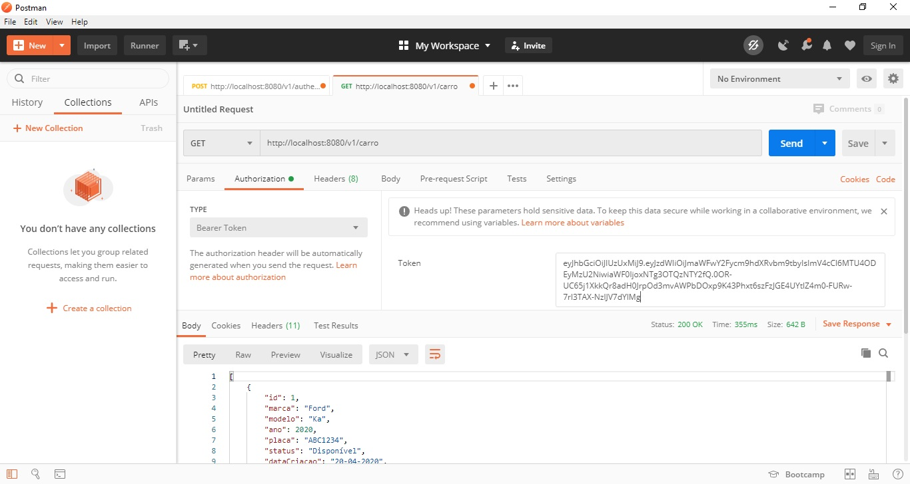
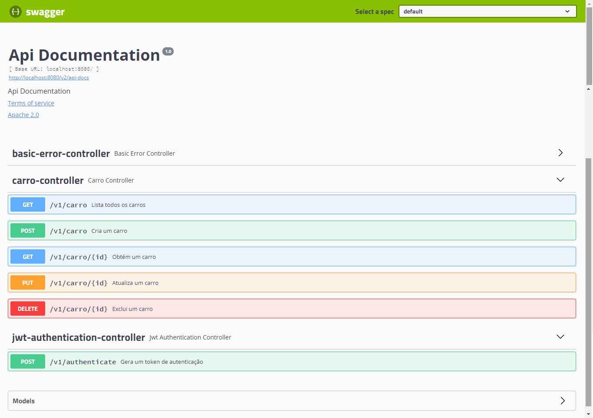
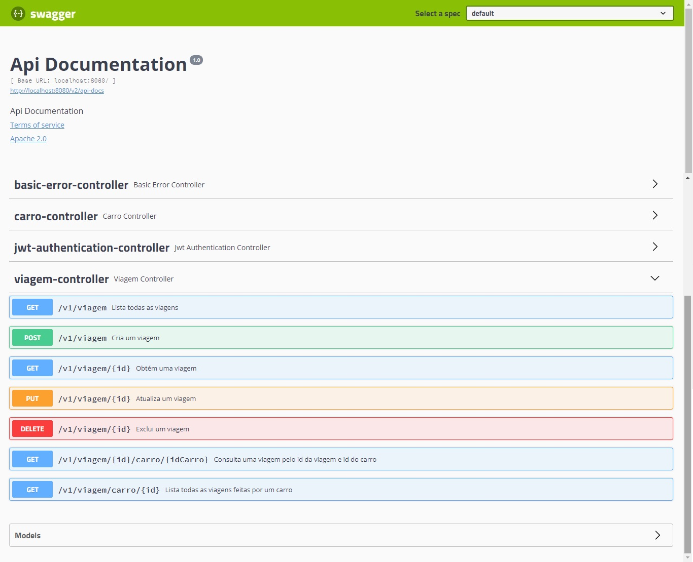

# Projeto Carro Autônomo FIAP

## Pré-requisitos para execução da aplicação de carro autônomo

- Tecnologias necessárias.

  1- Para executar o projeto é necessário ter o JRE 8 ou JDK 8 instalado.
  
  2- Utilizar uma IDE para execução. (Eclipse é recomendado)
  
 ---

## Componentes utilizados

  - Spring Web
  
  - Spring Security
  
  - Spring Data JPA
  
  - H2 Database
  
  - JUnit (testes)
  
  - Swagger (documentação)

 ---

## Instalação e execução do projeto

`$ git clone https://github.com/camisbressan/fiap-carro-autonomo.git`

No diretório `src` no pacote `br.com.fiap.carro.autonomo` existe um arquivo chamado `CarroApplication.java`. Abra esse arquivo e execute Run.

A carga de dados de carro inicial será feita através do arquivo `/src/main/resources/data.sql` e pode ser validada pela API de listagem de carros (http://localhost:8080/v1/carro) via Postman. 

Como teremos uma integração com front-end, todas as rotas obrigarão a utilização de um token para validação do acesso.

Segue abaixo exemplo de acesso as rotas no Postman.

Passo 1 - Gerar token de validação (http://localhost:8080/v1/authenticate), simulando o acesso de uma empresa parceira:

{
  "senha": "password",
  "usuario": "fiapcarroautonomo"
}

Passo 2 - Listar carros (http://localhost:8080/v1/carro) utilizando o token gerado:

## Demais rotas para gestão de carros

A aplicação permite a criação, edição e exclusão de um carro, além da rota de listar todos os carros e buscar um carro específico.

http://localhost:8081/swagger-ui.html

## Rotas para gestão de viagens

A aplicação permite a consulta, criação, edição e exclusão de uma viagem, além da rota de consultar uma viagem pelo id da viagem e id do carro, e listar todas as viagens feitas por um carro.

http://localhost:8081/swagger-ui.html

## Testes unitários

